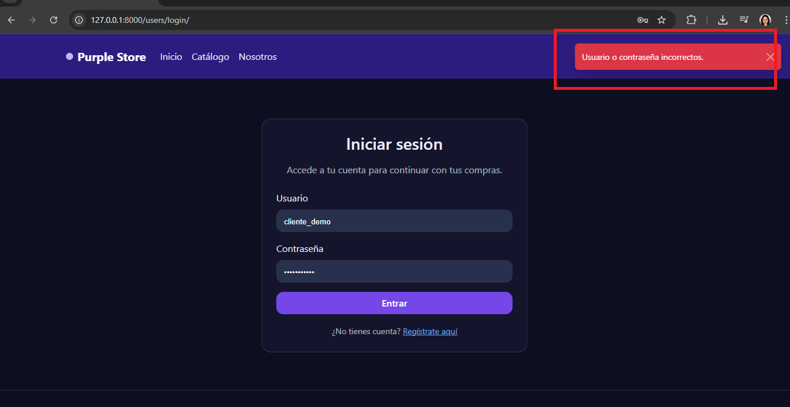
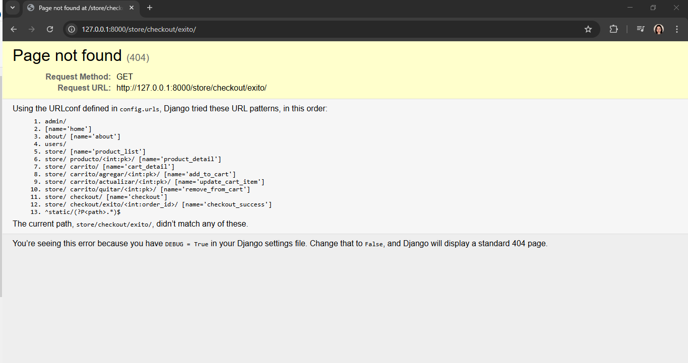

# Bug Reports

## BUG-001

- **Título:** Login con campos vacíos muestra mensaje incorrecto
- **Severidad:** Media
- **Prioridad:** Media

- **Pasos para reproducir:**
  1. Ir a login
  2. No ingresar datos
  3. Presionar ingresar

- **Resultado esperado:**
  - El sistema debe indicar que los campos son obligatorios

- **Resultado actual:**
  - El sistema muestra un mensaje genérico de error en los datos ingresados

- **Impacto:**
  - Puede confundir al usuario, ya que no indica claramente la causa del error

- **Evidencia:**

---

## BUG-002

- **Título:** Acceso a checkout con carrito vacío redirige a página 404
- **Severidad:** Media
- **Prioridad:** Media

- **Pasos para reproducir:**
  1. Asegurarse de que el carrito esté vacío
  2. Intentar acceder al flujo de checkout

- **Resultado esperado:**
  - El sistema debe bloquear el acceso mostrando un mensaje claro indicando que no hay productos en el carrito

- **Resultado actual:**
  - El sistema redirige a una página 404

- **Impacto:**
  - Puede confundir al usuario al mostrar un error genérico en lugar de una explicación clara

- **Evidencia:**

## BUG-003

- **Título:** La vista de login lanza error JavaScript al cargar la página
- **Severidad:** Media
- **Prioridad:** Media

- **Pasos para reproducir:**
  1. Acceder a la vista de login
  2. Abrir la consola del navegador
  3. Esperar la carga completa de la página

- **Resultado esperado:**
  - La página debe cargar sin errores de JavaScript

- **Resultado actual:**
  - Se produce un error `Cannot set properties of null (setting 'textContent')` durante la carga

- **Impacto:**
  - Puede afectar el comportamiento de la interfaz y bloquear pruebas automatizadas

- **Evidencia:**
